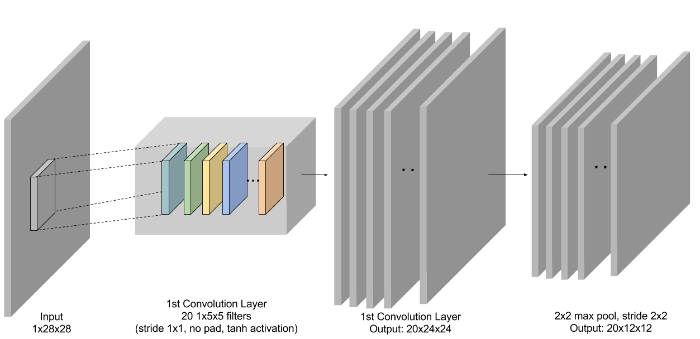

[![Contributors][contributors-shield]][contributors-url]
[![Forks][forks-shield]][forks-url]
[![Stargazers][stars-shield]][stars-url]
[![Issues][issues-shield]](https://github.com/aadimangla/IMDB-Movie-Reviews-Sentiment-Analysis/issues)
[![MIT License][license-shield]][license-url]
[![LinkedIn][linkedin-shield]][linkedin-url]


<!-- PROJECT LOGO -->
<br />
<p align="center">
<!--   <a href="">
    
  </a> -->

  <h1 align="center">Handwritten Digit Classification</h1>

  <p align="center">
    <!-- An awesome README template to jumpstart your projects! -->
    <br />
<!--     <a href=""><strong>Explore the docs »</strong></a> -->
    <br />
    <br />
    <!--<a href="">View Demo</a>
    ·
    <a href="">Report Bug</a>
    · -->
    <a href="https://github.com/aadimangla/Handwritten-Digit-Classification/issues">Request Feature</a>
  </p>
</p>


---
<!-- TABLE OF CONTENTS -->
## Table of Contents

* [About the Project](#about-the-project)
  * [Built With](#built-with)
* [Getting Started](#getting-started)
  * [Prerequisites](#prerequisites)
* [Usage](#usage)
* [Roadmap](#roadmap)
* [Contributing](#contributing)
* [License](#license)
* [Contact](#contact)
* [Acknowledgements](#acknowledgements)

---

<!-- ABOUT THE PROJECT -->
## About The Project

The MNIST database of handwritten digits, available from this page, has a training set of 60,000 examples, and a test set of 10,000 examples. It is a subset of a larger set available from NIST. The digits have been size-normalized and centered in a fixed-size image.
It is a good database for people who want to try learning techniques and pattern recognition methods on real-world data while spending minimal efforts on preprocessing and formatting.

Four files are available on this site:

train-images-idx3-ubyte.gz:  training set images (9912422 bytes)
train-labels-idx1-ubyte.gz:  training set labels (28881 bytes)
t10k-images-idx3-ubyte.gz:   test set images (1648877 bytes)
t10k-labels-idx1-ubyte.gz:   test set labels (4542 bytes)

Offline handwriting recognition, often referred to as optical character recognition, is performed after the writing is completed by converting the handwritten document into digital form. The advantage of offline recognition is that it can be done at any time after the document has been written, even years later. The disadvantage is that it is not done in real time as a person writes and therefore not appropriate for immediate text input.


Here's why:
* The advantage of offline recognition is that it can be done at any time after the document has been written, even years later. The disadvantage is that it is not done in real time as a person writes and therefore not appropriate for immediate text input.

The dataset is available at [THE MNIST DATABASE of handwritten digits](http://yann.lecun.com/exdb/mnist/) .


### Built With

This was build using following frameworks, libraries and softwares.
* [Tensorflow](https://www.tensorflow.org/)
* [Keras](https://keras.io/)
* [Matplotlib](https://matplotlib.org/)

---
<!-- GETTING STARTED -->
## Getting Started

To run this project you need to follow the following steps.

## Getting Started

To run this project you need to follow the following steps.

### Prerequisites

These are the prerequisites you need to build this bot as well as run it.

```sh
cmd:\ pip install tensorflow
cmd:\ pip install keras
```
#### Extra SETUP
- Create conda environment and create project in this environment
- After installing requirements in above Modules LIST
- You need python idle such as Jupyter notebook or spyder
<!-- #### How to Train ?
- ##### To use default Rasa configs
```sh
$ rasa train
```
- ##### To use spacy config pipeline (Fast to train)
```sh
$ rasa train -c spacy_config.yml
```
-->

<!-- #### How to run 
- ##### To run action server
```sh
$ rasa run actions --actions actionserver.actions
```
- ##### To run rasa in debug mode to inspect slot filling and entities ..,
```sh
$ rasa shell --debug
```
- ##### To run rasa in normal shell
```sh
$ rasa shell
```
-->
---
### Model Architecture


---
<!-- USAGE EXAMPLES -->
## Usage

Applications of offline handwriting recognition are numerous: reading postal addresses, bank check amounts, and forms. Furthermore, OCR plays an important role for digital libraries, allowing the entry of image textual information into computers by digitization, image restoration, and recognition methods.

---

<!-- ROADMAP -->
## Roadmap

See the [open issues](https://github.com/aadimangla/Handwritten-Digit-Classification/issues) for a list of proposed features (and known issues).


---
<!-- CONTRIBUTING -->
## Contributing

Contributions are what make the open source community such an amazing place to be learn, inspire, and create. Any contributions you make are **greatly appreciated**.

1. Fork the Project
2. Create your Feature Branch (`git checkout -b feature/AmazingFeature`)
3. Commit your Changes (`git commit -m 'Add some AmazingFeature'`)
4. Push to the Branch (`git push origin feature/AmazingFeature`)
5. Open a Pull Request

---

<!-- LICENSE -->


## License

[](http://badges.mit-license.org)

- **[MIT license](http://opensource.org/licenses/mit-license.php)**
- Copyright 2020 © <a href="http://adityamangla.com" target="_blank">Aditya Mangla</a>.

---

<!-- CONTACT -->
## Contact

Aditya Mangla - [@aadimangla](https://twitter.com/aadimangla) - aadimangla@gmail.com - [adityamangla.com](http://www.adityamangla.com/index.html)

Project Link: [https://github.com/aadimangla/Handwritten-Digit-Classification](https://github.com/aadimangla/Handwritten-Digit-Classification)

---

<!-- ACKNOWLEDGEMENTS -->
## Acknowledgements
* [Tensorflow](https://www.tensorflow.org/)
* [Keras](https://keras.io/)
* [Matplotlib](https://matplotlib.org/)
* [Embedding Projector](https://projector.tensorflow.org/)


<!-- MARKDOWN LINKS & IMAGES -->
<!-- https://www.markdownguide.org/basic-syntax/#reference-style-links -->
[contributors-shield]: https://img.shields.io/github/contributors/aadimangla/Handwritten-Digit-Classification.svg?style=flat-square
[contributors-url]: https://github.com/aadimangla/Handwritten-Digit-Classificationl/graphs/contributors
[forks-shield]: https://img.shields.io/github/forks/aadimangla/Handwritten-Digit-Classification.svg?style=flat-square
[forks-url]: https://github.com/aadimangla/Handwritten-Digit-Classification/network/members
[stars-shield]: https://img.shields.io/github/stars/aadimangla/Handwritten-Digit-Classification.svg?style=flat-square
[stars-url]: https://github.com/aadimangla/Handwritten-Digit-Classification/stargazers
[issues-shield]: https://img.shields.io/github/issues/aadimangla/Handwritten-Digit-Classification.svg?style=flat-square
[issues-url]: https://github.com/aadimangla/Handwritten-Digit-Classification/issues
[license-shield]: https://img.shields.io/github/license/aadimangla/Handwritten-Digit-Classificationl.svg?style=flat-square
[license-url]: https://github.com/aadimangla/Handwritten-Digit-Classification/blob/master/LICENSE.txt
[linkedin-shield]: https://img.shields.io/badge/-LinkedIn-black.svg?style=flat-square&logo=linkedin&colorB=555
[linkedin-url]: https://linkedin.com/in/aadimangla
[product-screenshot]: images/screenshot.png
